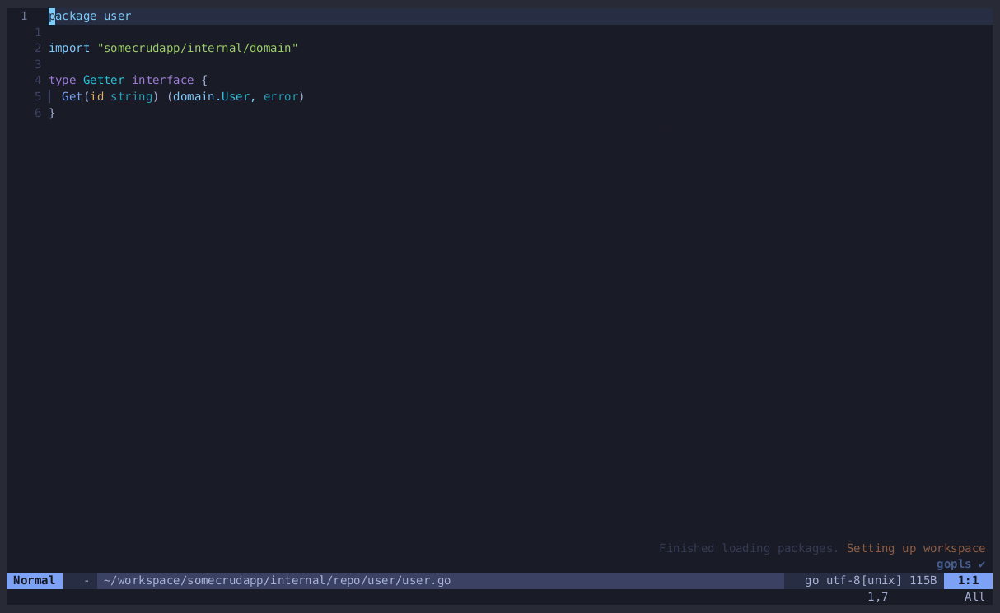

# GO Pattern Implement Integration For Neovim



## Prequisites

 1. `go-pattern-implement` available in path 

## Install And Example Setup With Lazy

```
{
	"relardev/go-pattern-implement.nvim",
	opts = {},
	keys = {
		{ "<leader>n", ":GoImplement<CR>", mode = "v" },
		{ "<leader>n", ":GoImplementPaste<CR>", mode = "n" },
	},
	cmd = {
		"GoImplement",
		"GoImplementPaste",
	},
	dependencies = {
		{ "nvim-lua/plenary.nvim" },
	}
}

```

## Usage

select fragment of code you want implementation for in visual selection and call `:GoImplement`, to paste implementation where you want it do `:GoImplementPaste`
